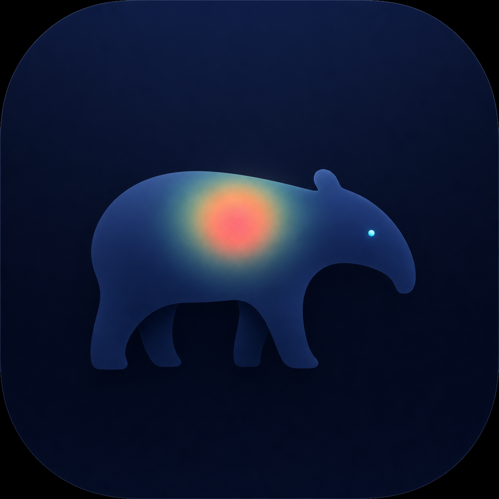

# Tapir / 貘

**中文** · [English](README.en.md)

<p align="center">
  
</p>

> **Eat the clicks you forget.**
> 一个 macOS 菜单栏小工具。CGEventTap 监听全局点击 → Accessibility 翻译成 UI 语义 → SQLite 本地存 → SwiftUI/Charts 出热力图和图表。
> 一天结束，给你一张漂亮的屏幕点击热力图 + 应用排行 + 时间线。

数据**只存本地**，无网络请求。

<p align="center">
  
  <br>
  <sub>↑ 一天结束 Tapir 自动出的分享图。完全去隐私：没有窗口标题、没有按钮文本、没有 URL，只有点击坐标的密度可视化 + 几个匿名统计。</sub>
</p>

> 命名小故事：Tapir 是貘。tap（点击）藏在动物名里；东亚神话里的貘会吃掉你不记得的梦——和「记录你自己都没意识到的操作」对得很自然。

---

## 工程结构

```
.
├── Package.swift
├── Sources/
│   ├── ClickInsightCore/          底层模块（Swift 包内部名沿用，外部叫 Tapir）
│   │   ├── Models.swift           ClickEvent / DailyReport / HeatPoint ...
│   │   ├── Permissions.swift      Accessibility 权限检查
│   │   ├── EventTap.swift         CGEventTap 包装
│   │   ├── ContextResolver.swift  NSWorkspace + AXUIElement 解析点击上下文
│   │   ├── Storage.swift          SQLite（system sqlite3，零外部依赖）
│   │   └── Recorder.swift         协调器（@MainActor, ObservableObject）
│   └── ClickInsightApp/           SwiftUI 菜单栏 App
│       ├── ClickInsightApp.swift  @main, MenuBarExtra + ReportWindow
│       ├── MenuBarView.swift      菜单栏面板：今日计数 / 开停 / 权限引导
│       ├── ReportWindow.swift     报告主窗口
│       ├── Charts.swift           ReportCard + 排行榜 + 时间线
│       ├── Heatmap.swift          KDE 渲染器（高斯卷积 + inferno 色映射）
│       └── Sharing.swift          分享构图 + 复制/保存 PNG
├── Resources/
│   ├── Info.plist                 LSUIElement + Accessibility 权限说明
│   └── branding/                  品牌素材（Tapir logo）
└── scripts/
    ├── make-app.sh                构建 + 打包 + 自动 codesign + 智能 TCC 处理
    ├── make-icon.sh               把 PNG 转 .icns
    └── setup-identity.sh          生成稳定的本地代码签名身份（一次性）
```

## 一次性设置（推荐）

```bash
bash scripts/setup-identity.sh     # 创建稳定签名身份，TCC 授权能跨 build 保留
bash scripts/make-icon.sh          # 生成 AppIcon.icns
bash scripts/make-app.sh           # 编译 + 打包成 Tapir.app
open Tapir.app
```

不跑 `setup-identity.sh` 也能用——只是每次 build 都会被 macOS 当成新 App，得重新授权 Accessibility。

`scripts/make-app.sh` 会自动：
- 检测代码签名身份是否变了
- 变了 → `tccutil reset` + `pkill` 老进程，确保下次启动是干净的 re-grant
- 没变 → 直接 ad-hoc 或稳定身份签名，TCC 授权延续

## 首次启动

菜单栏右上会出现一个小光标图标（不抢 Dock）。点开：

1. **Accessibility**：点「授予」会弹系统对话框 + 跳到「系统设置 → 隐私与安全 → 辅助功能」，打开 Tapir 的开关
2. **开始录制**：按下绿色按钮，绿点亮表示在录

之后再次打开菜单栏面板，「今日点击」会实时增长。

## 报告

菜单栏 → **打开报告**。窗口结构（自上而下）：

- **5 个 KPI 卡片**：总点击 / 左键 / 右键 / 高频 App / 活跃时段
- **屏幕点击热力图**：真正的 KDE（核密度估计）渲染——SQL 拉 4px 网格 → Float 缓冲区 → 可分离高斯卷积（σ ≈ 7 屏幕像素）→ sqrt 动态范围压缩 → inferno 色映射 → CGImage。带屏幕坐标角标 + 色阶图例 + 「**分享**」菜单（复制到剪贴板 / 保存 PNG）
- **全天节奏**：每小时点击量面积+折线图，自动高亮峰值小时
- **高频应用 / 高频 UI 元素**：leaderboard 风格双列排行（序号 + 名称 + 渐变长条 + 数字 + 百分比）

DatePicker 支持回看任意一天。

## 分享

热力图卡片右上角「↑ 分享」菜单：
- **复制图片到剪贴板** — 立刻能粘到 Notion / 微信 / 推特
- **保存为 PNG…** — 默认文件名 `ClickInsight-YYYY-MM-DD.png`

分享出去的图片是**独立构图**（不是窗口截图），包含品牌头 + 大号总点击数 + 热力图 + 色阶图例 + 5 个统计 + 「仅本地数据」脚注，2x retina。

## 数据存哪

```
~/Library/Application Support/ClickInsight/
└── events.db                     SQLite，表 clicks
```

直接查：

```bash
sqlite3 ~/Library/Application\ Support/ClickInsight/events.db \
  "SELECT app_name, ax_role, ax_title, COUNT(*) FROM clicks
   WHERE ts > strftime('%s','now','start of day')
   GROUP BY 1,2,3 ORDER BY 4 DESC LIMIT 30;"
```

## 隐私边界

- 只订阅鼠标 down 事件，不记录键盘内容
- 不截屏、不录屏（截图功能已移除）
- 没有任何网络请求
- 想清空：删 `~/Library/Application Support/ClickInsight/` 整个目录

## 已知限制 / 可继续做

- 多屏目前只按主屏的逻辑坐标渲染热力图
- 没有「随登录启动」（手动加 LaunchAgent 或 `SMAppService` 即可）
- 没有跨天 / 周报 / 月报视图
- AX 解析在部分 Electron / 游戏中拿不到子元素，会 fall back 到 role
- 菜单栏图标暂用 SF Symbol（18px 下貘剪影会糊），等真做 SVG glyph 再换

## 品牌素材

- `Resources/branding/tapir-icon-v4.png` — 当前 logo 源图（1024×1024）
- `Resources/branding/AppIcon.icns` — 由 `make-icon.sh` 从源图生成的 .app 图标
- `Resources/branding/tapir-icon-v2.png`、`tapir-icon-v3.png` — 早期方向备选

换 logo：替换源 PNG → 跑 `bash scripts/make-icon.sh path/to/new.png` → 重打包。

## 开发

```bash
swift build              # debug
swift run Tapir          # 直接跑（缺 Info.plist，AX 弹窗文案会丢，仅快速 smoke test 用）
```

历史包名沿用 `ClickInsight`（Swift target / 可执行文件名 / Bundle ID），避免重置已有 TCC 授权。对外品牌一律 Tapir。

## License

MIT.
